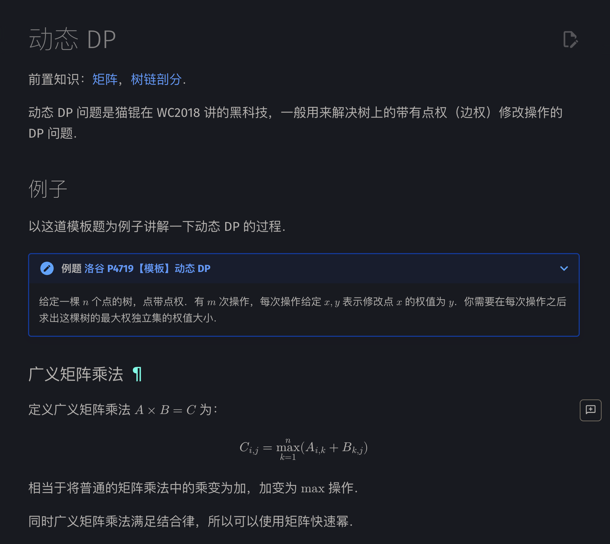
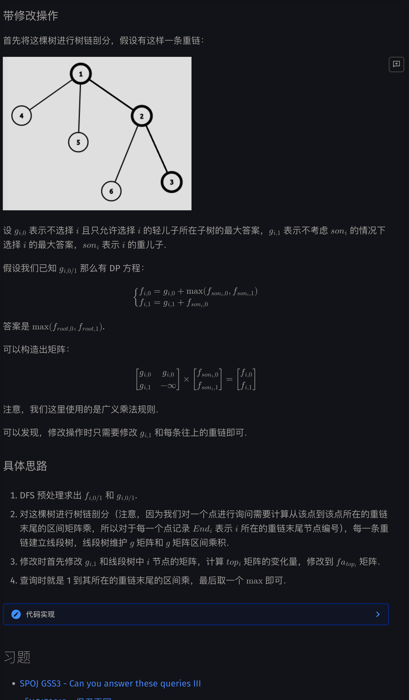
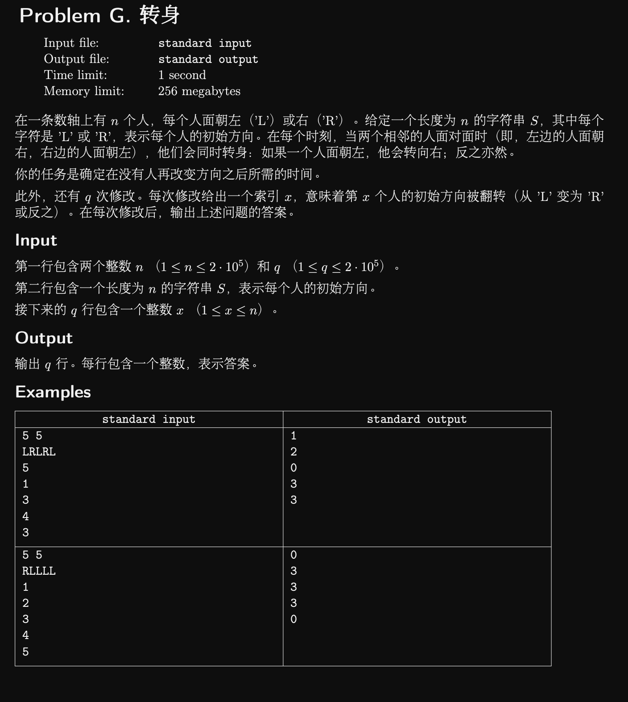
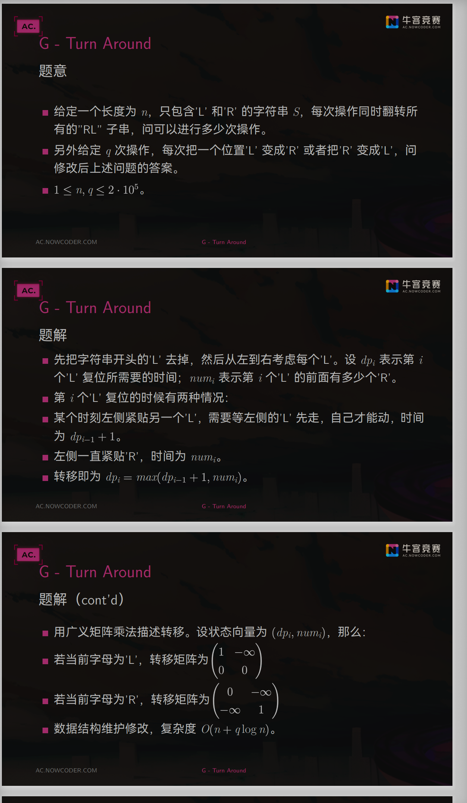

```cpp
#include <algorithm>
#include <cstring>
#include <iostream>

using namespace std;

constexpr int MAXN = 500010;
constexpr int INF = 0x3f3f3f3f;

int Begin[MAXN], Next[MAXN], To[MAXN], e, n, m;
int sz[MAXN], son[MAXN], top[MAXN], fa[MAXN], dis[MAXN], p[MAXN], id[MAXN],
    End[MAXN];
// p[i]表示i树剖后的编号，id[p[i]] = i
int cnt, tot, a[MAXN], f[MAXN][2];

struct matrix {
  int g[2][2];

  matrix() { memset(g, 0, sizeof(g)); }

  matrix operator*(const matrix &b) const  // 重载矩阵乘
  {
    matrix c;
    for (int i = 0; i <= 1; i++)
      for (int j = 0; j <= 1; j++)
        for (int k = 0; k <= 1; k++)
          c.g[i][j] = max(c.g[i][j], g[i][k] + b.g[k][j]);
    return c;
  }
} Tree[MAXN], g[MAXN];  // Tree[]是建出来的线段树，g[]是维护的每个点的矩阵

void PushUp(int root) { Tree[root] = Tree[root << 1] * Tree[root << 1 | 1]; }

void Build(int root, int l, int r) {
  if (l == r) {
    Tree[root] = g[id[l]];
    return;
  }
  int Mid = (l + r) >> 1;
  Build(root << 1, l, Mid);
  Build(root << 1 | 1, Mid + 1, r);
  PushUp(root);
}

matrix Query(int root, int l, int r, int L, int R) {
  if (L <= l && r <= R) return Tree[root];
  int Mid = (l + r) >> 1;
  if (R <= Mid) return Query(root << 1, l, Mid, L, R);
  if (Mid < L) return Query(root << 1 | 1, Mid + 1, r, L, R);
  return Query(root << 1, l, Mid, L, R) *
         Query(root << 1 | 1, Mid + 1, r, L, R);
  // 注意查询操作的书写
}

void Modify(int root, int l, int r, int pos) {
  if (l == r) {
    Tree[root] = g[id[l]];
    return;
  }
  int Mid = (l + r) >> 1;
  if (pos <= Mid)
    Modify(root << 1, l, Mid, pos);
  else
    Modify(root << 1 | 1, Mid + 1, r, pos);
  PushUp(root);
}

void Update(int x, int val) {
  g[x].g[1][0] += val - a[x];
  a[x] = val;
  // 首先修改x的g矩阵
  while (x) {
    matrix last = Query(1, 1, n, p[top[x]], End[top[x]]);
    // 查询top[x]的原本g矩阵
    Modify(1, 1, n,
           p[x]);  // 进行修改(x点的g矩阵已经进行修改但线段树上的未进行修改)
    matrix now = Query(1, 1, n, p[top[x]], End[top[x]]);
    // 查询top[x]的新g矩阵
    x = fa[top[x]];
    g[x].g[0][0] +=
        max(now.g[0][0], now.g[1][0]) - max(last.g[0][0], last.g[1][0]);
    g[x].g[0][1] = g[x].g[0][0];
    g[x].g[1][0] += now.g[0][0] - last.g[0][0];
    // 根据变化量修改fa[top[x]]的g矩阵
  }
}

void add(int u, int v) {
  To[++e] = v;
  Next[e] = Begin[u];
  Begin[u] = e;
}

void DFS1(int u) {
  sz[u] = 1;
  int Max = 0;
  f[u][1] = a[u];
  for (int i = Begin[u]; i; i = Next[i]) {
    int v = To[i];
    if (v == fa[u]) continue;
    dis[v] = dis[u] + 1;
    fa[v] = u;
    DFS1(v);
    sz[u] += sz[v];
    if (sz[v] > Max) {
      Max = sz[v];
      son[u] = v;
    }
    f[u][1] += f[v][0];
    f[u][0] += max(f[v][0], f[v][1]);
    // DFS1过程中同时求出f[i][0/1]
  }
}

void DFS2(int u, int t) {
  top[u] = t;
  p[u] = ++cnt;
  id[cnt] = u;
  End[t] = cnt;
  g[u].g[1][0] = a[u];
  g[u].g[1][1] = -INF;
  if (!son[u]) return;
  DFS2(son[u], t);
  for (int i = Begin[u]; i; i = Next[i]) {
    int v = To[i];
    if (v == fa[u] || v == son[u]) continue;
    DFS2(v, v);
    g[u].g[0][0] += max(f[v][0], f[v][1]);
    g[u].g[1][0] += f[v][0];
    // g矩阵根据f[i][0/1]求出
  }
  g[u].g[0][1] = g[u].g[0][0];
}

int main() {
  cin.tie(nullptr)->sync_with_stdio(false);
  cin >> n >> m;
  for (int i = 1; i <= n; i++) cin >> a[i];
  for (int i = 1; i <= n - 1; i++) {
    int u, v;
    cin >> u >> v;
    add(u, v);
    add(v, u);
  }
  dis[1] = 1;
  DFS1(1);
  DFS2(1, 1);
  Build(1, 1, n);
  for (int i = 1; i <= m; i++) {
    int x, val;
    cin >> x >> val;
    Update(x, val);
    matrix ans = Query(1, 1, n, 1, End[1]);  // 查询1所在重链的矩阵乘
    cout << max(ans.g[0][0], ans.g[1][0]) << '\n';
  }
  return 0;
}
```







```cpp
#include<bits/stdc++.h>
#ifdef LWY
#include "debug.h"
#else
#define debug(...) 0
#endif
using namespace std;
#define ll long long
#define endl '\n'
#define PII pair<int,int>
#define PLL pair<ll,ll>
//#define int long long
const ll mod1=1e9+7,mod2=998244353;
const int INF = 1e9, N = 2e5 + 10;
//不开long long 见祖宗！！！！
struct node
{
    array<array<int, 2>, 2> x;
    node() : x{array<int,2>{0, -INF}, array<int,2>{-INF, 0}} {}
    node(int x1, int x2, int x3, int x4): x({array<int,2>{x1, x2}, array<int,2>{x3, x4}}) {};
};
node operator+(const node xk, const node yk){
    node res;
    for (int i = 0; i < 2; i++)
    {
        for (int j = 0; j < 2; j++)
        {
            for (int k = 0; k < 2; k++)
            {
                res.x[i][j] = max(res.x[i][j], xk.x[i][k] + yk.x[k][j]);
            }
        }
    }
    return res;
}
node char_node(char x)
{
    if (x == 'L') return node(1, -INF, 0, 0);
    return node(0, -INF, -INF, 1);
}
void print(int L, int R, node res)
{
    cerr << L << "~" << R << " : " << endl;
    if (res.x[1][0] < 0) cerr << "R" << endl;
    else cerr << "L" << endl;
    cerr << res.x[0][0] << " " << res.x[0][1] << endl;
    cerr << res.x[1][0] << " " << res.x[1][1] << endl;
    cerr << endl;
}
vector<node> tr(N << 2), a(N);
int ls(int p){ return p << 1;}
int rs(int p){ return p << 1 | 1;}
void push_up(int p)
{
    tr[p] = tr[ls(p)] + tr[rs(p)];
}
void build(int p, int L, int R)
{
    if (L == R)
    {
        tr[p] = a[L];
        // print(L, R, a[L]);
        return;
    }
    int mid = (L + R) / 2;
    build(ls(p), L, mid);
    build(rs(p), mid + 1, R);
    push_up(p);
}
void update(int p, int L, int R, int id, node &val)
{
    if (L == R)
    {
        tr[p] = val;
        return;
    }
    int mid = (L + R) / 2;
    if (id <= mid)
    {
        update(ls(p), L, mid, id, val);
    }
    else 
    {
        update(rs(p), mid + 1, R, id, val);
    }
    push_up(p);
}
node query(int p, int pl, int pr, int L, int R)
{
    if (R < pl || L > pr) return node();
    if (pl <= L && R <= pr) return tr[p];
    int mid = (pl + pr) / 2;
    node res = query(ls(p), pl, mid, L, R) + query(rs(p), mid + 1, pr, L, R);
    return res;
}
void solve()
{
    int n, q;
    cin >> n >> q;
    set<int> idR;
    string s;
    cin >> s;
    for (int i = 1; i <= n; i++)
    {
        if (s[i - 1] == 'R') idR.insert(i);
        a[i] = char_node(s[i - 1]);
    }
    node Lk = char_node('L');
    node Rk = char_node('R');
    build(1, 1, n);
    while (q--)
    {
        // cerr << s << endl;
        int id;
        cin >> id;
        if (s[id - 1] == 'R')
        {
            idR.erase(id);
            s[id - 1] = 'L';
            update(1, 1, n, id, Lk);
        }
        else 
        {
            idR.insert(id);
            s[id - 1] = 'R';
            update(1, 1, n, id, Rk);
        }
        if (idR.size() == n || idR.size() == 0) cout << 0 << endl;
        else 
        {
            int k = *idR.begin();
            if (k == n - idR.size() + 1) cout << 0 << endl;
            else 
            {
                auto res = query(1, 1, n, k, n);
                // print(k, n, res);
                cout << res.x[1][0] << endl;
                // cout << max(max(res.x[0][0], res.x[1][0]), max(res.x[0][1], res.x[1][1])) << endl;
            }
        }
        // cerr << s << endl;
        // for (int i = 1; i <= n; i++)
        // {
        //     print(i, i, query(1, 1, n, i, i));
        // }
    }
}
signed main(){
    ios::sync_with_stdio(false);
    cin.tie(0),cout.tie(0);
    int t = 1;
    // cin >> t;
    while(t--)solve();
    return 0;
}
```